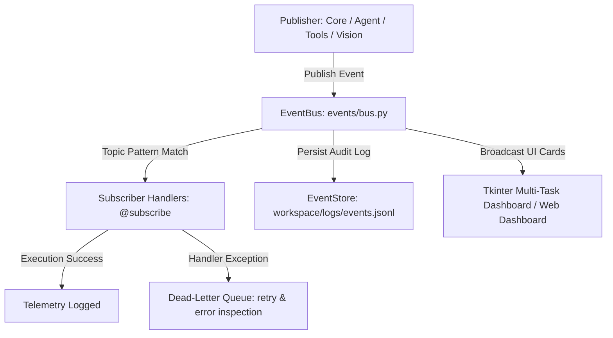

# 📡 BR JARVIS — Asynchronous Event Bus & Telemetry (`events/`)

> **Document Status**: Production Architecture Specification  
> **Subsystem**: Core Decoupled Event Messaging & Telemetry Audit  
> **Module Path**: `events/`  
> **Version**: MK37.31.0  

---

## 1. Executive Summary

The BR JARVIS **Event System** (`events/`) acts as the central asynchronous communication backbone for the entire AI Operating System. Built with zero tight coupling, it enables components to publish event notifications, record operational audit logs, track execution telemetry, stream multi-task UI status cards (`ui.py`), and manage unexpected handler errors via a Dead Letter Queue (DLQ).

---

## 2. Event Topology & Architecture

---

## 3. Component Taxonomy

| File | Class / Entity | Responsibility |
|---|---|---|
| [bus.py](file:///d:/BRJARVIS/Br-Jarvis/events/bus.py) | `EventBus` | Thread-safe, async Pub/Sub event dispatcher supporting wildcard topic subscriptions (e.g. `task.*`, `step_planner.*`, `system.error`). Includes Dead Letter Queue management. |
| [handlers.py](file:///d:/BRJARVIS/Br-Jarvis/events/handlers.py) | `@subscribe` | Decorator framework for registering synchronous and asynchronous subscriber functions. |
| [store.py](file:///d:/BRJARVIS/Br-Jarvis/events/store.py) | `EventStore` | High-throughput append-only JSONL persistent store logging system telemetry to `events.jsonl`. |
| [types.py](file:///d:/BRJARVIS/Br-Jarvis/events/types.py) | `Event`, `EventType`, `VisionEvent` | Enums and Pydantic v2 schemas defining event payloads across system lifecycle, step planning, vision graph updates, tasks, tools, errors, and security audits. |

---

## 4. Standard Event Topics & Event Types

- `system.startup` / `system.shutdown`: Core lifecycle state changes.
- `step_planner.conscious_decomposition` / `step_planner.budget_extended`: Conscious Step Planner goal decomposition & flexible step budget extensions.
- `task.react.start` / `task.react.completed` / `task.react.failed`: ReAct loop execution lifecycle.
- `screen.understood` / `graph.updated`: 7-Tier Hybrid Vision Engine semantic UI updates.
- `tool.invoked` / `tool.success` / `tool.error`: Tool runtime execution metrics.
- `security.alert` / `permission.denied`: Guardian safety and PathPolicy violation logs.
