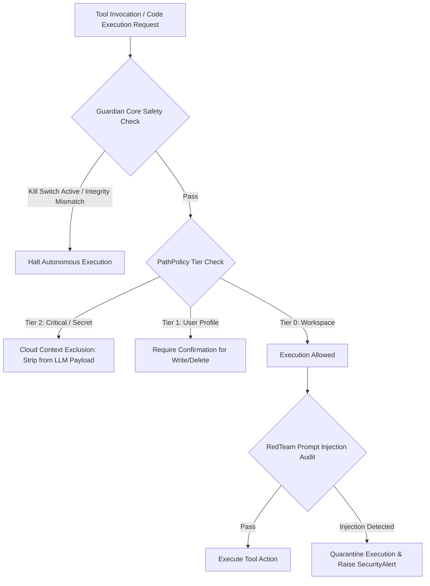

# 🛡️ BR JARVIS — Security Architecture, Guardian Core & Path Policy

> **Document Status**: Production Architecture Specification  
> **Subsystem**: Guardian Core, PathPolicy, Permission Modes, Secret Scanning & RedTeaming  
> **Module Path**: `guardian/`, `permissions.py`, `redteam/`  
> **Version**: MK37.31.0  

---

## 1. Executive Summary

BR JARVIS enforces a zero-trust multi-layered safety architecture. The **Guardian Core** (`guardian/`) acts as the immutable safety engine holding system integrity hashes, an emergency kill-switch (`kill_switch.py`), pre-upgrade snapshots (`snapshot.py`), automated rollbacks (`rollback.py`), and append-only audit logs (`audit_log.py`). File access is governed by **PathPolicy** (`guardian/path_policy.py` & `permissions.py`) across 3 security tiers, enforcing cloud-context exclusions for sensitive paths and strict secret scanning routines.

---

## 2. Security Architecture Topology

---

## 3. Guardian Core Subsystem Breakdown (`guardian/`)

| File | Class | Responsibility |
|---|---|---|
| [integrity.py](file:///d:/BRJARVIS/Br-Jarvis/guardian/integrity.py) | `SystemIntegrityChecker` | Verifies SHA-256 hashes of core safety files against `.guardian_hashes.json`. |
| [kill_switch.py](file:///d:/BRJARVIS/Br-Jarvis/guardian/kill_switch.py) | `KillSwitch` | Monitors `guardian/PAUSED` flag file, CLI pause commands, and global emergency hotkey. |
| [snapshot.py](file:///d:/BRJARVIS/Br-Jarvis/guardian/snapshot.py) | `SnapshotManager` | Manages pre-upgrade git commits, database backups, and rolling retention (20 snapshots / 7 days). |
| [rollback.py](file:///d:/BRJARVIS/Br-Jarvis/guardian/rollback.py) | `RollbackEngine` | Automated git and database state recovery if post-deploy healthchecks fail. |
| [audit_log.py](file:///d:/BRJARVIS/Br-Jarvis/guardian/audit_log.py) | `AuditLog` | Append-only JSONL audit ledger logging all autonomous events to `workspace/logs/autonomy_audit.jsonl`. |
| [path_policy.py](file:///d:/BRJARVIS/Br-Jarvis/guardian/path_policy.py) | `PathPolicy` | Path bounds validator ensuring workspace path isolation and cloud context exclusion. |

---

## 4. Tiered Path Policy & Secret Scanning Rules

- **Tier 0 (Workspace)**: Project files, `BR_WORKSPACE`, Desktop, Documents/Projects. Read/write permitted without prompting.
- **Tier 1 (User Profile)**: User home directory paths outside workspace. Read allowed; write/delete requires `CONFIRM_ALL` approval.
- **Tier 2 (OS-Critical & Secrets)**: System32, Windows registry hives, `Login Data`, `.ssh/`, `.gnupg/`, `*.pem`, `*.key`, crypto wallets. Denied by default; cloud context exclusion enforced (`cloud_context_exclusion_check`).
- **Secret Scanning Policy**: All source files and tool outputs pass through regex secret filters to prevent hardcoded API key fallbacks or credential exposure in version control or logs.
