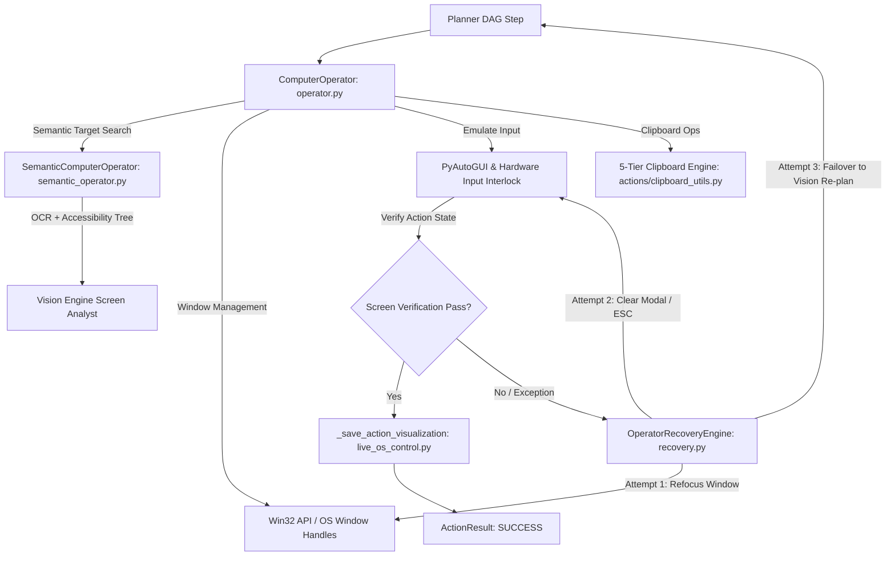

# 🖥️ BR JARVIS — Computer Operator Subsystem (`computer/` & `actions/`)

> **Document Status**: Production Architecture Specification  
> **Subsystem**: Hands-Free OS Automation, Desktop Control, 5-Tier Clipboard Engine & Live OS Visual Trace Overlays  
> **Module Path**: `computer/` & `actions/`  
> **Version**: MK37.31.0  

---

## 1. Executive Summary

The **Computer Operator** subsystem (`computer/`) grants BR JARVIS human-level OS control across Windows, Linux, and macOS. It combines PyAutoGUI hardware emulation, Win32 window handles, visual element localization (`semantic_operator.py`), 5-tier clipboard fallback (`actions/clipboard_utils.py`), visual grounding trace overlays (`actions/live_os_control.py`), and automated fault recovery (`recovery.py`) to execute desktop tasks safely.

---

## 2. Architecture & Subsystem Mapping

---

## 3. Subsystem Components & Responsibilities

| File | Primary Class | Function & OS Interlocks |
|---|---|---|
| [operator.py](computer/operator.py) | `ComputerOperator` | Master automation operator handling click, double_click, right_click, mouse_move, drag, type_text, key_combination, mouse_scroll, and active window switching with precise coordinate handling. |
| [clipboard_utils.py](actions/clipboard_utils.py) | `MultiBackendClipboard` | 5-layer prioritized clipboard engine fallback (`pyperclip` -> Win32 `ctypes` -> `tkinter` -> PowerShell -> CLI) for robust cross-platform clipboard copy/paste. |
| [live_os_control.py](actions/live_os_control.py) | `LiveOSController` | LLM visual screenshot action execution loop; generates red target crosshairs and action bounding footprint overlays (`_save_action_visualization()`) saved to `BR_WORKSPACE/Logs/live_os/`. |
| [semantic_operator.py](computer/semantic_operator.py) | `SemanticComputerOperator` | High-level GUI element finder that maps natural language labels (e.g. `"Submit Button"`, `"Search Bar"`) to bounding box coordinates via `vision/ocr_engine.py` and accessibility trees. |
| [recovery.py](computer/recovery.py) | `OperatorRecoveryEngine` | Self-healing recovery loop handling lost window focus, popup interruptions, mouse drift, and static screen frame hash alerts. |
| [types.py](computer/types.py) | `ComputerAction`, `ActionResult` | Pydantic v2 schemas for action payloads, coordinate targets, execution status, and screenshot verification diffs. |

---

## 4. Safety Policy & Human-in-the-Loop Interlocks

1. **Destructive Operations**: Disk partitioning, system file modifications, registry edits, or force killing system processes automatically trigger human consent confirmation (`requires_approval=True`).
2. **PyAutoGUI Failsafe**: Moving the mouse cursor to any screen corner instantly triggers `pyautogui.FailSafeException`, immediately aborting mouse automation.
3. **Execution Verification**: Every GUI operation captures a before-and-after frame hash to confirm expected UI state transitions and alerts when click actions produce no screen change (`is_static`).
