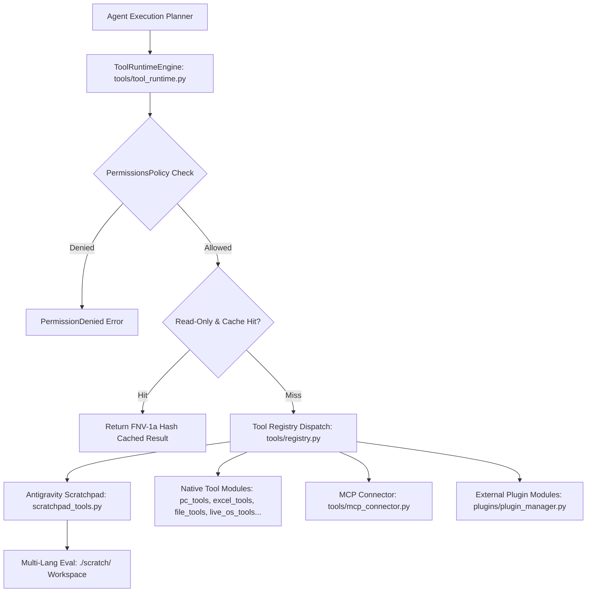

# 🔌 BR JARVIS — Plugin Platform & Tool Ecosystem (`plugins/` & `tools/`)

> **Document Status**: Production Architecture Specification  
> **Subsystem**: Extensible Plugin Manager, Universal Tool Registry & Antigravity Scratchpad  
> **Module Paths**: `plugins/`, `tools/`, and `agent/scratchpad.py`  
> **Version**: MK37.31.0  

---

## 1. Executive Summary

BR JARVIS features a modular plugin architecture (`plugins/`), a central tool registry (`tools/`) managing **98 specialized tools**, and the **Antigravity Scratchpad Subsystem** (`agent/scratchpad.py` & `tools/scratchpad_tools.py`). The system supports dynamic tool discovery, sandbox isolation, Model Context Protocol (MCP) server integration, multi-language transient script evaluation (`scratchpad_eval`), read-only FNV-1a hashing caching, and strict permission policies.

---

## 2. Plugin & Tool Architecture Topology

---

## 3. Component Taxonomy

| Module | Component / Class | Responsibility |
|---|---|---|
| [plugins/plugin_manager.py](plugins/plugin_manager.py) | `PluginManager` | Dynamic discovery, manifest parsing, isolated module loading, and plugin lifecycle hooks (`on_load`, `on_unload`). |
| [tools/registry.py](tools/registry.py) | `@register_tool`, `ToolRegistry` | Decorator-based tool registration engine that automatically generates JSON schemas for LLM tool invocation. |
| [agent/scratchpad.py](agent/scratchpad.py) | `ScratchpadEngine` | Isolated execution workspace at `./scratch/` supporting transient evaluation (`scratchpad_eval`) for Python, Node.js, PowerShell, and Bash with stdout/stderr capture. |
| [tools/scratchpad_tools.py](tools/scratchpad_tools.py) | 5 Scratchpad Tools | `scratchpad_write`, `scratchpad_read`, `scratchpad_eval`, `scratchpad_list`, `scratchpad_clear`. |
| [tools/tool_runtime.py](tools/tool_runtime.py) | `ToolRuntimeEngine` | High-level execution runtime enforcing permissions, input validation, execution timeouts, error sanitization, and caching. |
| [tools/mcp_connector.py](tools/mcp_connector.py) | `MCPConnector` | Adapter layer for connecting external Model Context Protocol (MCP) tool servers. |

---

## 4. Native Tool Plugin Modules (98 Tools)

- **`scratchpad_tools.py`**: Isolated workspace file creation, reading, listing, clearing, and script execution (`scratchpad_eval`).
- **`excel_tools.py`**: Excel report creation, sheet analysis (`analyze_project_to_excel`).
- **`pc_tools.py`**: Windows GUI control, window focus, process killing, system sound control.
- **`file_tools.py` & `workspace_tools.py`**: Workspace directory manipulation, file searches, safe edits.
- **`doc_tools.py`**: PDF, DOCX, and text document extraction and formatting.
- **`live_os_tools.py`**: Hardware metrics, network interfaces, memory usage.
- **`rag_tools.py`**: Vector store indexing, semantic search, document ingestion.
- **`redteam_tools.py`**: Security auditing, prompt injection testing, policy verification.
- **`skills_tools.py`**: Skill manifest loader and variable substitution engine.
