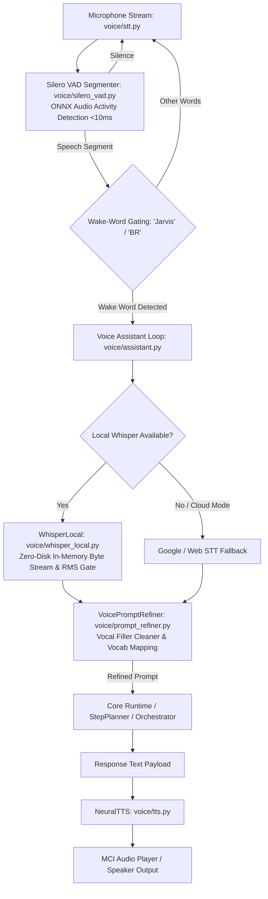

# 🎙️ BR JARVIS — Voice Assistant Subsystem (`voice/`)

> **Document Status**: Production Architecture Specification  
> **Subsystem**: Hands-Free Voice Loop, Silero VAD, Voice Prompt Refiner, Zero-Disk Whisper Streaming & Neural TTS  
> **Module Path**: `voice/`  
> **Version**: 38.0.0 (MK38 Architecture)  

---

## 1. Executive Summary

The **Voice Assistant Subsystem** (`voice/`) powers hands-free voice interaction for BR JARVIS. It features ONNX-based **Silero Voice Activity Detection** (`silero_vad.py`), wake-word gating, offline zero-disk local Automatic Speech Recognition (ASR) via OpenAI Whisper (`whisper_local.py`) with RMS silence gating and hallucination filtering, an acoustic **Voice Prompt Refinement Engine** (`prompt_refiner.py`), cloud speech recognition fallbacks (`stt.py`), multilingual language translation (`multilingual.py`), and neural Text-to-Speech synthesis with low-latency MCI audio playback (`tts.py`).

---

## 2. Audio Processing Topology

---

## 3. Voice Prompt Refinement Engine (`voice/prompt_refiner.py`)

Raw spoken speech frequently contains hesitation fillers, stutters, conversational bloat (`um`, `uh`, `ah`, `like`, `you know`, `please can you`, `hey jarvis`), and STT mishearings.

`VoicePromptRefiner` processes raw acoustic transcripts before passing them to the execution engine:
1. **Iterative Filler Stripping**: Iteratively cleans vocal hesitation patterns until the sentence stabilizes into clean actionable commands.
2. **Domain Vocabulary Mapping**: Replaces misheard technical terms using custom rules in `config/vocabulary.json`.
3. **Transparent UI Logging**: Logs both acoustic raw input and refined execution prompts to `JarvisUI`:
   - `🎙️ Spoken Raw: "um jarvis please check system memory and open chrome"`
   - `✨ Refined Prompt: "Check system memory and open chrome"`

---

## 4. Subsystem Components & Responsibilities

| File | Class / Entity | Primary Responsibility |
|---|---|---|
| [assistant.py](voice/assistant.py) | `BRVoiceAssistant` | Master voice loop coordinator handling state transitions (`IDLE`, `LISTENING`, `THINKING`, `SPEAKING`), wake-word gating, and interrupts. |
| [silero_vad.py](voice/silero_vad.py) | `SileroVAD` | Fast ONNX-based voice activity detector for acoustic chunking (<10ms latency overhead). |
| [prompt_refiner.py](voice/prompt_refiner.py) | `VoicePromptRefiner` | Acoustic speech cleaner, vocal filler stripper (`um`, `uh`, `like`), vocabulary mapper, and high-precision prompt generator. |
| [stt.py](voice/stt.py) | `SounddeviceMicrophone` | Zero-dependency `sounddevice` audio stream recorder and speech recognition adapter. |
| [whisper_local.py](voice/whisper_local.py) | `LocalWhisperASR` | Offline local OpenAI Whisper model worker with zero-disk in-memory byte streaming, RMS silence gate, and hallucination filter. |
| [tts.py](voice/tts.py) | `NeuralTTS` | Text-to-speech engine using PyTTSx3 / gTTS with SAPI5 COM safety and Win32 MCI low-latency audio stream playback. |
| [multilingual.py](voice/multilingual.py) | `MultilingualVoice` | Automatic language detection and translation wrapper supporting English, Tamil, Hindi, Spanish, French, and German. |
