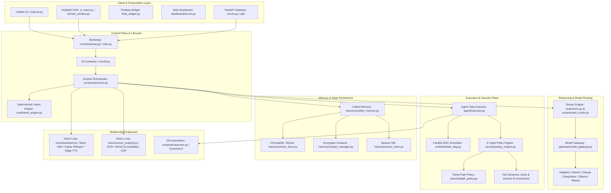

# BR JARVIS — CURRENT ARCHITECTURE SPECIFICATION

## 1. Executive Summary
BR JARVIS is an autonomous personal AI operating runtime and multimodal desktop assistant built for Windows (with Linux compatibility). It provides low-latency voice interaction, deep desktop automation, multi-provider LLM routing, and structured DAG workflow execution.

---

## 2. Current Subsystem Topology

---

## 3. Discovered Architectural Flaws & Inconsistencies
1. **Triplicate Model Execution Paths**: Coexistence of `backends/`, `gateway/`, and `router/smart_router.py`.
2. **Duplicated Tool & Action Systems**: 58 procedural scripts in `actions/` run in parallel with 63 schema tools in `tools/`.
3. **Fragmented Storage State**: 8 independent SQLite and JSON stores across `.jarvis/`, `memory_db/`, and `memory/`.
4. **Monolithic Intent Engine**: `core/intent_engine.py` is 1,811 lines with hardcoded application mappings.
