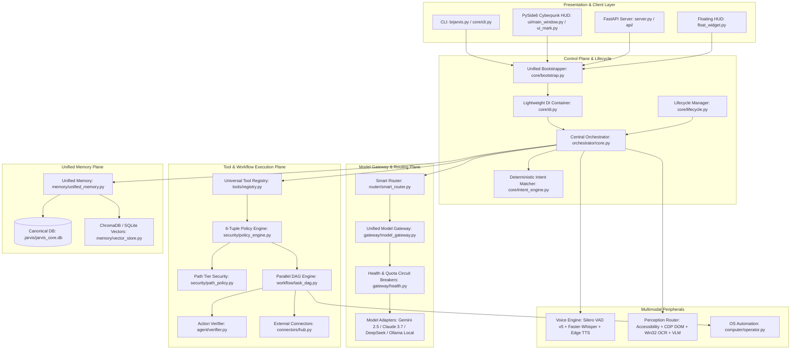

# BR JARVIS — FINAL CANONICAL TARGET ARCHITECTURE (FROZEN)

## 1. Architectural Mission & The Personal-Project Principle
BR JARVIS is an autonomous, multimodal personal AI operating runtime for a single developer.

### Core Engineering Invariants:
1. **Single-Owner Subsystems**: Exactly ONE canonical implementation per responsibility (One Bootstrapper, One Model Gateway, One Tool Registry, One Memory Store, One Voice Loop, One Perception Router).
2. **Unified Cognitive Core**: Voice, Vision, Desktop GUI, Web Dashboard, and CLI feed the exact same central `JarvisOrchestrator`. There is no separate "voice brain" or "vision brain".
3. **Execution Truth Model**: Execution states are strictly decoupled: `REQUESTED → PLANNED → AUTHORIZED → EXECUTING → EXECUTED → OBSERVED → VERIFIED → RECOVERING → RESPONSE`. A successful tool return code is never assumed to be goal completion without post-condition verification.
4. **Deterministic Security Boundary**: Untrusted External Input → Injection Shield → Action Proposal → 6-Tuple Policy → Sandboxed Execution. The LLM cannot self-authorize.
5. **Single-Store Persistence**: All relational state, task steps, episodic turns, contacts, and procedural lessons live in `.jarvis/jarvis_core.db` operating in SQLite WAL mode with single-writer asynchronous locks.

---

## 2. Canonical Subsystem Hierarchy

---

## 3. Canonical Layer Responsibilities

| Layer / Subsystem | Canonical Path | Primary Invariant | Competing Systems Replaced / Deleted |
| :--- | :--- | :--- | :--- |
| **Bootstrapper** | `core/bootstrap.py` | Single thread-safe `AssistantRuntime` singleton | `core/bootstrapper.py`, `start.py` duplicate logic |
| **Model Gateway** | `gateway/model_gateway.py` | Multi-key rotation, error normalization, circuit breakers | Direct ad-hoc backend calling |
| **Model Router** | `router/smart_router.py` | Task-complexity, capability & health-aware ranking | Duplicate router branches |
| **Tool Registry** | `tools/registry.py` | Declarative schemas, 6-tuple policy validation | `actions/*` procedural scripts |
| **Memory Store** | `memory/canonical_db.py` | Unified SQLite WAL mode with `sqlite_lock.py` | 8 separate `.db`/`.json` storage files |
| **Voice Engine** | `voice/assistant.py` | Silero VAD v5 + local Whisper + streaming Edge TTS + barge-in | Multiple overlapping audio loops |
| **Vision Perception** | `vision/engine.py` | Cheapest-sufficient perception (A11y → CDP → OCR → VLM) | Standalone optical guessers |
| **Artifact Export** | `agent/artifacts.py` | Strict `sandbox_path != host_path` with SHA256 export | Direct unexported browser consumption |
| **Security Policy** | `security/policy_engine.py` | Deterministic 6-tuple: `(User, Device, App, Resource, Action, Risk)` | Ad-hoc regex sanitizers |
