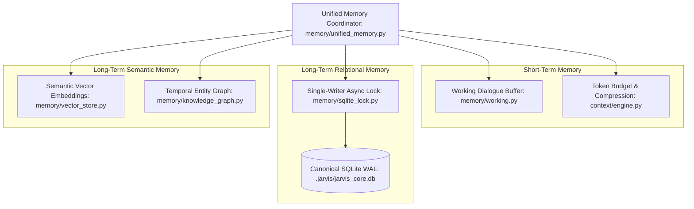

# BR JARVIS — FINAL UNIFIED MEMORY ARCHITECTURE

## 1. Architectural Invariants
1. **Single Relational Database**: All relational tables (tasks, steps, checkpoints, contacts, routines, lessons, audit logs) reside in `.jarvis/jarvis_core.db` operating in SQLite WAL mode.
2. **Single Vector Store**: Semantic vector embeddings reside in `memory/vector_store.py` (backed by ChromaDB or pure-Python NumPy SQLite vectors) using `text-embedding-004`.
3. **Single Memory Coordinator**: `memory/unified_memory.py` is the unified facade providing hybrid search (Cosine Vector Similarity + BM25 Keywords + Recency Decay).

---

## 2. Memory Subsystem Hierarchy

---

## 3. Storage Consolidation Mapping
| Legacy Storage Location | Format | Data Contained | Target Canonical Store |
| :--- | :--- | :--- | :--- |
| `memory_db/chroma.sqlite3` | SQLite | Semantic document & chat embeddings | `memory/vector_store.py` (`.jarvis/vectors.db`) |
| `memory_db/lessons.db` | SQLite | Procedural self-correction lessons | `.jarvis/jarvis_core.db` (`lessons` table) |
| `.jarvis/calendar.db` | SQLite | Scheduled events & appointments | `.jarvis/jarvis_core.db` (`calendar_events` table) |
| `.jarvis/app_tracker.db` | SQLite | Application launch usage stats | `.jarvis/jarvis_core.db` (`app_usage` table) |
| `.jarvis/contacts.json` | AES Encrypted | CRM contact book & relationships | `.jarvis/jarvis_core.db` (`contacts` table, encrypted fields) |
| `memory/processed_messages.db`| SQLite | Message deduplication cache | `.jarvis/jarvis_core.db` (`message_dedup` table) |
| `history/session_store.py` | SQLite | Turn-by-turn chat transcripts | `.jarvis/jarvis_core.db` (`sessions` & `messages` tables) |
