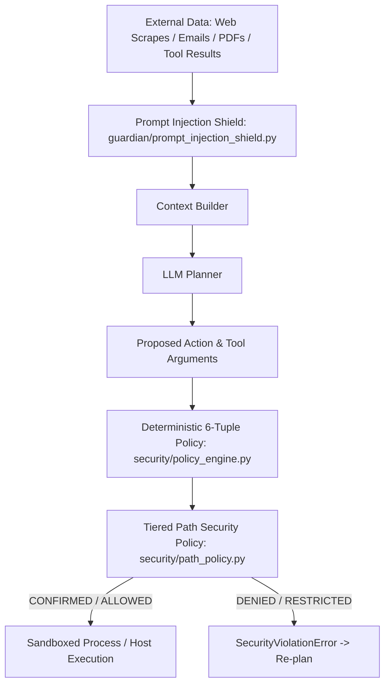

# BR JARVIS — FINAL SECURITY & POLICY ARCHITECTURE

## 1. Deterministic Security Perimeter
BR JARVIS operates on zero-trust principles for all model proposals and external data streams:

---

## 2. Invariant Security Policies
1. **The Model Cannot Self-Authorize**: Every tool proposal must pass through `security/policy_engine.py`.
2. **Untrusted External Content Rule**: Web pages, email bodies, and PDF text cannot grant execution privileges or alter permissions mode.
3. **Hard Path Denylist**:
   - `C:\Windows`, `C:\Program Files`, `System32`, `~/.ssh`, `~/.aws`, `.env`, `*.key`.
   - Access to denylist paths is rejected unconditionally with zero human override allowed.
4. **Artifact Sandbox Isolation**: `sandbox_path != host_path`. AI processes write to sandbox folders; artifacts become visible to the host only after explicit verification and SHA256 hashing via `agent/artifacts.py`.
