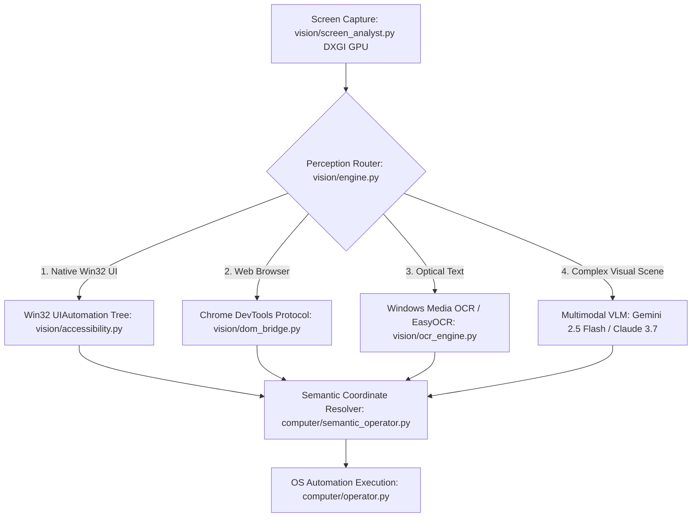

# BR JARVIS — FINAL VISION & PERCEPTION ARCHITECTURE

## 1. Architectural Invariants
1. **Cheapest-Sufficient Perception Router**: Perception tasks query structured UI representations before escalating to optical models:
   $$\text{Accessibility Tree (Win32)} \rightarrow \text{DOM Tree (CDP)} \rightarrow \text{Windows OCR} \rightarrow \text{VLM Downscaled Image} \rightarrow \text{Full-Res VLM Patch}$$
2. **Dual-Resolution Capture**: Downsample canvas to 1024x1024 for global visual context tokens; crop 100% native resolution bounding boxes around target elements for fine OCR.

---

## 2. Perception Pipeline Hierarchy

