# BR JARVIS — FINAL VOICE & AUDIO MULTIMODAL ARCHITECTURE

## 1. Architectural Invariants
1. **Single Voice Loop Daemon**: `voice/assistant.py` (`BRVoiceAssistant`) runs the full-duplex voice loop in a dedicated thread communicating with the UI via Qt Signals.
2. **Sub-300ms End-to-End Latency Budget**:
   $$\text{Mic Buffer (30ms)} + \text{Silero VAD (1.2ms)} + \text{Faster-Whisper STT (180ms)} + \text{Gemini Flash TTFT (350ms)} + \text{Edge TTS Streaming TTFB (150ms)}$$
3. **Instant Barge-In**: If VAD speech probability exceeds 0.85 while TTS audio is playing, playback is aborted in < 15ms and `voice/tts_queue.py` is cleared.

---

## 2. Voice Pipeline Component Specifications

```mermaid
graph LR
    Mic[Microphone: SounddeviceMicrophone] --> RingBuffer[Pre-roll Ring Buffer: 500ms]
    RingBuffer --> VAD[Silero VAD v5 ONNX: 30ms frames]
    VAD --> STT[STT: Faster-Whisper Local / Gemini STT]
    STT --> Refiner[Prompt Refiner: Strip Fillers]
    Refiner --> CognitiveCore[Orchestrator Cognitive Core]
    CognitiveCore --> TTSQueue[Priority Speech Queue]
    TTSQueue --> TTS[TTS: Edge-TTS / Piper-TTS / SAPI5]
    TTS --> Speaker[Speakers / Output Device]

    VAD -.->|Barge-In Interrupt| TTSQueue
```

| Component | Primary Implementation | Fallback Implementation | Latency Target |
| :--- | :--- | :--- | :--- |
| **Voice Activity Detection** | Silero VAD v5 ONNX (`voice/silero_vad.py`) | Energy-based RMS (`core/native_bridge.py`) | < 2.0ms |
| **Speech-To-Text (ASR)** | `faster-whisper` INT8 (`voice/whisper_local.py`) | Cloud Gemini STT (`voice/gemini_stt.py`) | < 250ms |
| **Text-To-Speech (TTS)** | Microsoft Edge TTS (`voice/tts.py`) | Local Piper TTS / Windows SAPI5 | < 200ms TTFB |
| **Barge-In Cancellation** | Real-time VAD probability hook in `voice/assistant.py` | Silence threshold timer | < 20ms |
