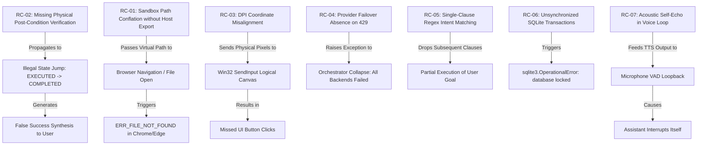

# BR JARVIS — ROOT CAUSE DEPENDENCY & PROPAGATION GRAPH

## 1. The Core Failure Propagation Pipeline

---

## 2. Highest-Leverage Root Cause Node
The single node whose resolution eliminates the highest volume of user-facing failure symptoms is:
**`RC-02: Mandatory Physical Post-Condition Verification & Execution Truth`**

Fixing `RC-02` guarantees that regardless of tool failures, timeout anomalies, or sub-agent errors, **false-positive success responses are mathematically impossible**.
