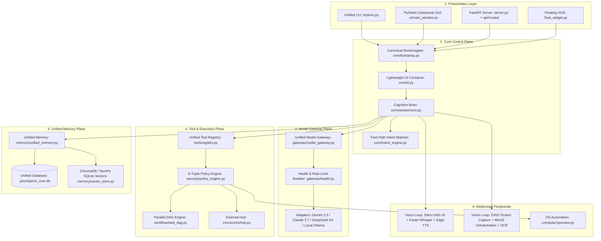

# BR JARVIS — PRODUCTION TARGET ARCHITECTURE

## 1. Architectural Philosophy & Design Principles
The Target Architecture optimizes for a single-developer personal operating runtime:
1. **Zero Redundancy**: Exactly one canonical way to invoke models, execute tools, store memories, and bootstrap the runtime.
2. **Deterministic Security Boundary**: Untrusted input → Model Proposal → 6-Tuple Policy → Sandboxed Execution.
3. **Multimodal First**: Native real-time voice (VAD + Whisper + Streaming TTS) and instant screen perception.
4. **Single-Store Persistence**: All relational, episodic, contact, and preference state unified into `.jarvis/jarvis_core.db`.
5. **High Maintainability**: Modular components under 500 lines with clear interfaces and zero circular imports.

---

## 2. Target Layer Architecture

---

## 3. Key Upgrades Delivered in Target Architecture
- **Unified Gateway**: All LLM calls pass through `gateway/model_gateway.py` with automated multi-key rotation and zero-loss local fallback.
- **Action & Tool Consolidation**: `actions/` is refactored into declarative tools in `tools/` and external connectors in `connectors/`.
- **Database Unification**: All fragmented `.db` and `.json` state stores consolidated into `.jarvis/jarvis_core.db` with single-writer lock.
