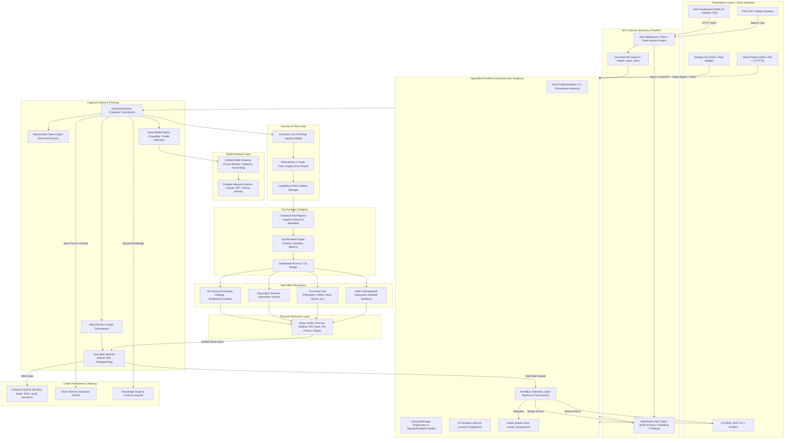

# BR JARVIS FULL-SYSTEM ARCHITECTURAL MAP & DEPENDENCY GRAPH

## 1. Canonical End-to-End Control Plane Flow

---

## 2. Forensic Audit: Existing Alternate & Competing Paths

| Component Area | Canonical Implementation | Alternate / Competing Paths Discovered | Resolution & Unification Strategy |
| :--- | :--- | :--- | :--- |
| **Runtime & Boot** | `core/runtime.py` (`ApplicationRuntime`) & `core/bootstrap.py` | `start.py`, `server.py`, `dashboard/server.py`, `brjarvis.py` | Unify all launchers to delegate to `CoreBootstrapper.initialize_runtime()` and `create_app()`. Eliminate duplicated bootstrap scripts. |
| **Dashboard / Web Server** | `api/server.py` (`create_app()`) | `dashboard/server.py` (legacy 41KB script with custom AES over HTTP) | Deprecate `dashboard/server.py`. Make `api/server.py` the sole authoritative HTTP/WS server hosting `/` and `/web`. |
| **Authentication** | `api/routes/auth.py` (session tokens, short-lived WS tickets, Bearer auth) | Raw query parameter tokens (`/ws?token=...`), custom AES-256 in browser JS | Standardize on secure session exchange: REST session login / ticket endpoint -> one-time single-use ticket for WebSocket handshake. |
| **Configuration** | `core/config.py` (`JarvisConfig` via Pydantic v2) | Direct `os.environ.get()` calls scattered in `start.py`, `actions/`, `tools/`, `config/api_keys.json` | Centralize precedence: Defaults → `config/models.json` / `api_keys.json` → `.env` → `os.environ` → Runtime overrides in `JarvisConfig`. |
| **Tool Registry & Execution** | `tools/registry.py` & `tools/tool_runtime.py` | Ad-hoc tool callers in `agent/executor.py`, raw string error returns | Bind `tools/registry.py` and `tools/tool_runtime.py` to always return standardized `ToolResult` contracts with status, verification, and timing. |
| **Task State & Engine** | `agent/task_state.py` (`TaskStateManager` + SQLite WAL) | Ad-hoc dictionaries in `orchestrator/core.py`, in-memory lists in `agent/executor.py` | Centralize all task state in `TaskStateManager` and synchronize over `EventBus`. |
| **Model Gateway** | `gateway/model_gateway.py` (`ModelGateway`) & `router/smart_router.py` | Direct backend calls in `backends/gemini.py`, `backends/anthropic.py` | Ensure all LLM completions pass through `ModelGateway` with circuit breakers, timeouts, and usage accounting. |
| **Version Ownership** | Canonical version in `core/version.py` (`40.2.0`) | Hardcoded `"38.5.0"` in `pyproject.toml`, `api/server.py`, `web/app.js`, `setup.py` | Create single source of truth in `core/version.py` and propagate to package, API, UI, CLI, and health checks. |

---

## 3. Subsystem Layers & Contracts

### 3.1 Presentation Layers
- **Web UI (`web/`)**: Vanilla JS client consuming `/api/v1/*` and `/ws`. Renders real-time verified task progress, tool execution status, artifacts, and logs without executing client-side business logic.
- **CLI (`core/cli.py`)**: Rich TUI interface with typed mode profiles (`/mode general|coder|analyst|recon|exploit|report`), streaming output, cancellation support, and direct runtime binding.
- **Desktop HUD (`ui_mark.py`, `float_widget.py`)**: Glassmorphic GUI subscribing to system telemetry and audio/vision pipelines.

### 3.2 Security & Policy Boundaries
- **Prompt Injection Defense**: `guardian/prompt_injection_shield.py` inspects incoming prompts, web pages, and tool outputs before they reach the model.
- **Policy Gate**: `security/policy_engine.py` evaluates 6-tuple `(User, Session, Device, Resource, Capability, Risk)` with fail-closed semantics (`ActionDecision.DENY`).
- **Path & Shell Hardening**: `security/path_policy.py` restricts file operations to isolated workspace bounds. Shell tools disallow unsanitized model interpolation.

### 3.3 Verification & Observability
- **Action Verifier (`agent/verifier.py`)**: Evaluates real physical world consequences (e.g. process existence, window title, HTTP status, file readability).
- **Structured Logging (`core/logging.py`)**: Formats JSON logs with correlation IDs (`request_id`, `task_id`, `execution_id`) and redacts credentials automatically.
- **Event Bus (`events/bus.py`)**: Distributes typed system, task, and tool telemetry to all subscribed clients.
