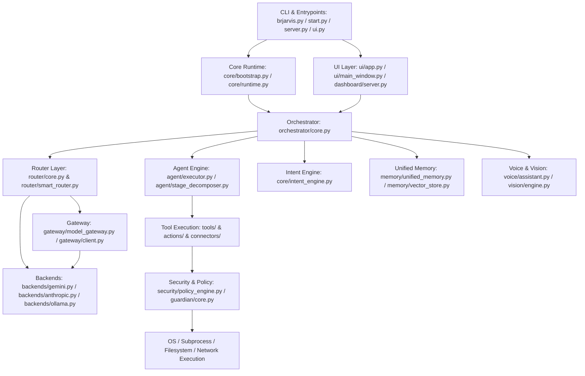

# 02 — RECONSTRUCTED STATIC & RUNTIME DEPENDENCY GRAPH

## 1. Architectural Dependency Hierarchy
The actual dependency flow discovered across the BR JARVIS codebase is structured into five distinct operational tiers:

---

## 2. Module Import Matrix & Cross-Subsystem Coupling

### A. Core Runtime Dependencies
- `core/runtime.py` → imports `core/config.py`, `core/lifecycle.py`, `core/di.py`, `core/logging.py`.
- `core/bootstrap.py` → imports `core/runtime.py`, `orchestrator/core.py`, `memory/unified_memory.py`, `router/core.py`.
- `core/intent_engine.py` → imports `actions/*`, `tools/*`, `core/workspace_engine.py`, `memory/contact_manager.py`. **[High Coupling: Directly imports 20+ action files!]**

### B. Orchestrator Dependencies
- `orchestrator/core.py` → imports `router/core.py`, `gateway/model_gateway.py`, `agent/executor.py`, `agent/planner.py`, `memory/unified_memory.py`, `voice/assistant.py`, `vision/engine.py`, `guardian/core.py`, `security/policy_engine.py`.
- Acts as the central hub of the system.

### C. Competing Router & Model Gateway Layers
- **Path 1 (Direct Backend Adapter)**: `orchestrator/core.py` → `router/core.py` → `backends/gemini.py` (Local direct API SDK).
- **Path 2 (Proxy Gateway Client)**: `orchestrator/core.py` → `gateway/model_gateway.py` → `gateway/client.py` (HTTP Proxy Brain Client).
- **Path 3 (Smart Router)**: `router/smart_router.py` → `gateway/models_registry.py` → `gateway/execution.py`.
- *Finding*: Three independent model invocation pipelines coexist with duplicated fallback logic and conflicting configuration keys (`GEMINI_API_KEY`, `PROXY_BRAIN_KEY`, `GATEWAY_TOKEN`).

### D. Duplicate Tool Execution Layers (`actions/` vs `tools/`)
- `tools/legacy_actions_tools.py` dynamically wraps legacy scripts in `actions/`.
- `agent/executor.py` loads tools from `tools/` and `connectors/hub.py`.
- `core/intent_engine.py` directly invokes procedural functions from `actions/browser_control.py`, `actions/open_app.py`, `actions/file_controller.py`.

---

## 3. Circular Dependencies & Import-Time Side Effects
1. **`core.intent_engine` ↔ `actions.*`**: `actions/automation_engine.py` imports `core/intent_engine.py` while `core/intent_engine.py` imports `actions/automation_engine.py`. Resolved at runtime via deferred inside-function imports.
2. **`ui.main_window` ↔ `voice.assistant`**: UI initializes VoiceAssistant, while VoiceAssistant takes a callback to `ui.main_window.update_waveform()`.
3. **`memory.unified_memory` ↔ `memory.contact_manager`**: Unified memory initializes contact manager which registers itself back into memory context.
