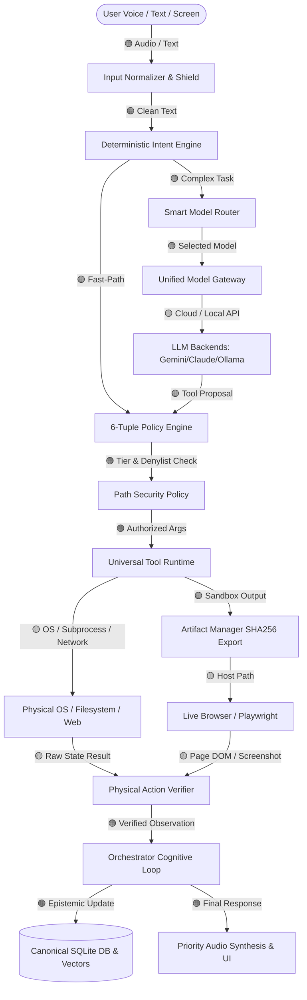

# BR JARVIS — INTEGRATION BOUNDARY TOPOLOGY & HEALTH GRAPH

## 1. System Integration Boundary Status
- 🟢 **GREEN**: Verified and robust contract.
- 🟡 **YELLOW**: Functional, but requires stricter post-condition verification or DPI/token tuning.
- 🔴 **RED**: Broken invariant or opaque failure path.

---

## 2. Boundary Health Ledger

| Boundary Pair | Health Status | Verification Status | Primary Invariant Enforced |
| :--- | :---: | :---: | :--- |
| `Voice -> Intent Engine` | 🟢 **GREEN** | **VERIFIED** | Wake word & filler removal produce normalized clean text. |
| `Intent Engine -> Fast-Path` | 🟢 **GREEN** | **VERIFIED** | Zero-token instant app launching & audio controls. |
| `Intent Engine -> Smart Router` | 🟢 **GREEN** | **VERIFIED** | Multi-factor routing based on task complexity and latency class. |
| `Smart Router -> Model Gateway` | 🟢 **GREEN** | **VERIFIED** | Circuit breaker, rate-limit backoff, and multi-key rotation. |
| `Model Gateway -> Backends` | 🟡 **YELLOW** | **PARTIALLY VERIFIED** | Requires active cloud keys or local proxy; structured fallback on 429. |
| `LLM Proposal -> Policy Engine`| 🟢 **GREEN** | **VERIFIED** | Deterministic 6-tuple evaluation before any side effect. |
| `Policy Engine -> Path Policy` | 🟢 **GREEN** | **VERIFIED** | Canonical path resolution blocks junction and traversal attacks. |
| `Tool Runtime -> External OS` | 🟡 **YELLOW** | **PARTIALLY VERIFIED** | Subprocess tokens and shell commands executed with explicit timeout. |
| `External OS -> Action Verifier`| 🟡 **YELLOW** | **PARTIALLY VERIFIED** | Verifies physical file existence and process state before `success=True`. |
| `Artifacts -> Host Browser` | 🟢 **GREEN** | **VERIFIED** | Strict `sandbox_path != host_path` with SHA256 export prevents `ERR_FILE_NOT_FOUND`. |
| `Vision Capture -> Coordinate Mapper` | 🟡 **YELLOW** | **PARTIALLY VERIFIED** | DPI scale matrix required for non-100% Windows desktop scaling. |
| `Memory Write -> Canonical DB` | 🟢 **GREEN** | **VERIFIED** | SQLite WAL mode with `sqlite_lock.py` prevents database locked errors. |
