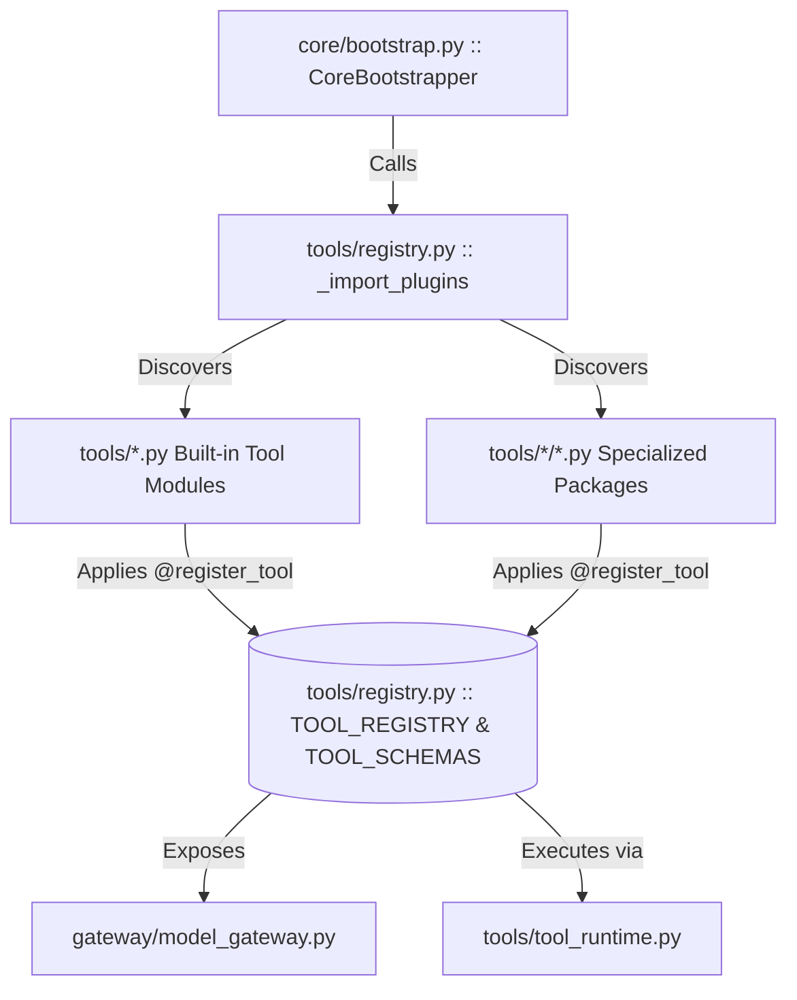

# BR JARVIS — TOOL REGISTRATION GRAPH & DISCOVERY FORENSICS

## 1. Registration Architecture Overview
BR JARVIS implements a dual registration pipeline:
1. **Static Decorator Registration**: `@register_tool(name, description, parameters)` in tool modules.
2. **Dynamic Plugin Auto-Discovery**: `_import_plugins(full=True)` in `tools/registry.py` scans `tools/` and subpackages on startup.
3. **Lazy Proxy Wrappers**: Dynamic import shims for optional heavyweight dependencies (`playwright`, `fpdf2`, `scapy`, `nmap`).

---

## 2. Module Registration Matrix

| Module Path | Primary Registration Mode | Tools Registered | Lazy Import Guard | Status |
| :--- | :--- | :---: | :--- | :---: |
| `tools/registry.py` | Central Registry Hub | All | None | **CANONICAL** |
| `tools/tool_runtime.py` | Execution Runtime Engine | 0 (Engine) | None | **CANONICAL** |
| `tools/reminder_tools.py` | Static Decorator | 2 (`schedule_reminder`, `manage_reminders`) | None | **ACTIVE** |
| `tools/system_tools.py` | Static Decorator | 2 (`system_cleanup`, `system_optimizer`) | `psutil` | **ACTIVE** |
| `tools/browser_automation.py` | Dynamic Plugin | 8 (`browser_navigate`, `browser_click`, etc.) | `playwright` | **ACTIVE** |
| `tools/pdf_tools.py` | Dynamic Plugin | 1 (`pdf_tool`) | `pypdf`/`fpdf2` | **ACTIVE** |
| `tools/export_tools.py` | Static Decorator | 2 (`export_artifact`, `list_artifacts`) | None | **ACTIVE** |
| `tools/sandbox_process.py` | Static Decorator | 1 (`run_sandboxed_process`) | None | **ACTIVE** |
| `tools/agent_tools.py` | Static Decorator | 4 (`spawn_subagent`, `inspect_task`, etc.) | None | **ACTIVE** |
