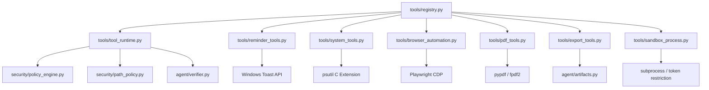

# BR JARVIS — TOOL SUBSYSTEM DEPENDENCY GRAPH

## 1. Subsystem Call Hierarchy

```mermaid
graph TD
    tools_registry[tools/registry.py] --> tools_runtime[tools/tool_runtime.py]
    tools_runtime --> security_policy[security/policy_engine.py]
    tools_runtime --> path_policy[security/path_policy.py]
    tools_runtime --> verifier[agent/verifier.py]
    
    tools_registry --> reminder_tools[tools/reminder_tools.py]
    tools_registry --> system_tools[tools/system_tools.py]
    tools_registry --> browser_tools[tools/browser_automation.py]
    tools_registry --> pdf_tools[tools/pdf_tools.py]
    tools_registry --> export_tools[tools/export_tools.py]
    tools_registry --> sandbox_tools[tools/sandbox_process.py]
    
    reminder_tools --> win32_toast[Windows Toast API]
    system_tools --> psutil[psutil C Extension]
    browser_tools --> playwright[Playwright CDP]
    pdf_tools --> pypdf[pypdf / fpdf2]
    export_tools --> artifacts_mgr[agent/artifacts.py]
    sandbox_tools --> subprocess_mod[subprocess / token restriction]
```
