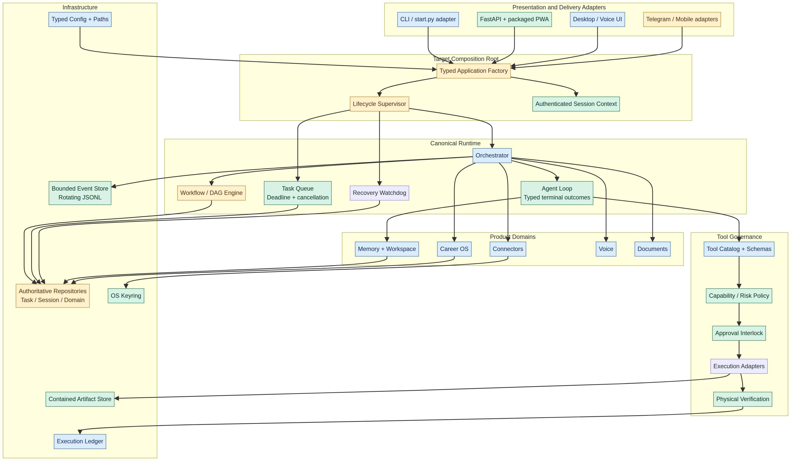

# BR-JARVIS

[](https://github.com/bharthraj1412/BrJarvis/actions)
[](LICENSE)
[]()

[]()
[](https://www.python.org/)

BR-JARVIS is a local agent runtime for verifiable task execution, software work, system automation, multimodal workflows, personal memory, connectors, and Career OS. The platform combines typed configuration, policy-controlled tools, recovery-aware tasks, evidence-led verification, a packaged FastAPI/PWA control plane, and desktop and voice adapters.

## Architecture

The installable package under `src/brjarvis` is the source of truth. Presentation adapters call a canonical runtime; tool execution passes through schema validation, security policy, approval, execution, and physical verification; durable state is owned by domain repositories and execution ledgers.



The detailed current-state assessment, ownership map, migration strategy, and risk register are in the [production-readiness audit](docs/audit/PRODUCTION_READINESS_2026-08-19.md).

## Requirements

Use Python **3.11, 3.12, 3.13, or 3.14** in a project-local virtual environment. Do not install BR-JARVIS into system Python and do not bypass dependency resolution with `--no-deps`.

## Installation

### Windows

```powershell
git clone https://github.com/bharthraj1412/BrJarvis.git
cd BrJarvis
.\setup_env.bat --dev
```

### Linux or macOS

```bash
git clone https://github.com/bharthraj1412/BrJarvis.git
cd BrJarvis
./setup_linux.sh --dev
```

The default bundle installs the web, document, and model-backend capabilities. Voice and hardware-bound desktop automation remain explicit because they require platform libraries:

```bash
python -m pip install -e ".[voice,automation]"
```

## Security configuration

Copy `.env.template` to `.env` and replace every placeholder. The web control plane will not start without a unique `JARVIS_SERVER_API_KEY` of at least 24 characters.

```bash
python -c "import secrets; print(secrets.token_urlsafe(32))"
```

Production settings should include:

```dotenv
JARVIS_PERMISSION_MODE=confirm_destructive
JARVIS_ENABLE_UNSAFE_HOST_EXECUTION=false
JARVIS_ENABLE_UNTRUSTED_PLUGINS=false
JARVIS_COOKIE_SECURE=true
JARVIS_CORS_ORIGINS=https://your-approved-origin.example
```

Localhost is not treated as an authentication boundary. The PWA exchanges the server key for an HttpOnly session and uses one-time WebSocket tickets; browser login responses never return the session bearer token. Connector secrets are stored through the operating-system keyring rather than plaintext JSON.


> If a real provider secret has ever been committed to Git, rotate it at the provider. Deleting the file or rewriting history does not invalidate the credential.

## Running BR-JARVIS

After installation, use the canonical console commands:

```bash
jarvis status
jarvis-cli
jarvis-server
```

A source checkout can also use the compatibility dispatcher:

```bash
python start.py status
python start.py cli
python start.py web
python start.py smoke
```

## Verification

Run the maintained regression suite:

```bash
python -m pytest tests -m "not benchmark" -q --tb=short --timeout=60
```

The current verified result is **309 passed, 1 skipped, and 2 benchmark tests deselected** in the maintained non-benchmark suite. Doctor diagnostics additionally report core versus optional dependency health, Python runtime metadata, non-secret credential-source status, and repair-attempt outcomes. CI reports quality, tests, packaging, architecture, security, dependencies, licenses, and secrets independently.

A release artifact must also pass an installed-wheel smoke test outside the checkout. The August 2026 production-hardening wheel installed into an empty external environment, constructed 51 routes, loaded the packaged PWA, passed dependency integrity, and did not resolve code from the source tree.

## Safety defaults

| Capability | Default behavior |
|---|---|
| Mutating tools | High-risk local-system actions require approval when metadata is incomplete. |
| Destructive actions | Confirmation required. |
| Code execution | Disabled unless unsafe host execution is explicitly enabled. |
| Community plugins | Disabled unless explicitly trusted. |
| Workspace files | Canonically resolved and contained. |
| Agent outcomes | Verified success, partial, failed, cancelled, and timed-out states are distinct. |
| Events | Bounded in memory, queued for persistence, and written to rotating JSONL files. |

## Optional dependency decisions

ChromaDB is not installed by default while its current release has an unresolved security advisory; canonical SQLite memory remains available. PyMuPDF is isolated behind the explicit `pdf-rendering` extra because its AGPL/commercial dual licensing requires a separate distribution review.

## Documentation

| Document | Purpose |
|---|---|
| [Production-readiness audit](docs/audit/PRODUCTION_READINESS_2026-08-19.md) | Full analysis, implemented changes, scorecard, residual risks, and release checklist |
| [Production operations runbook](docs/runbooks/PRODUCTION_OPERATIONS.md) | Secure setup, build, deployment, monitoring, incident response, and rollback |
| [Production architecture diagram](docs/architecture/production-architecture.png) | Current-to-target subsystem and ownership map |
| [Changelog](CHANGELOG.md) | Production-hardening changes and compatibility notes |
| [Manual operations guide](docs/operations/MANUAL_WORKS_AND_OPERATIONS_GUIDE.md) | Broader operator workflows |
